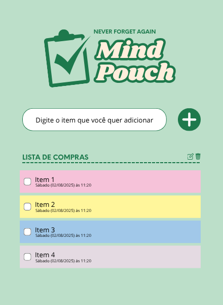

🛒 Mind Pouch – Lista de Compras Dinâmica

Aplicação web desenvolvida como parte prática do curso "JavaScript: Construindo páginas dinâmicas" da Alura. O projeto foi personalizado com novos estilos, fontes, estrutura de dados e melhorias na usabilidade, mantendo uma proposta visual minimalista e moderna.

✨ Funcionalidades

✅ Adição de itens na lista com nome e data/hora de criação;
📝 Itens podem ser editados ou excluídos individualmente;
📅 Registro automático de data e hora ao criar cada item;
✅ Checkbox para marcar os itens como comprados;
🎨 Interface redesenhada com paleta personalizada, tipografia moderna e melhor organização visual;

🛠️ Tecnologias e técnicas utilizadas

HTML5: estruturação semântica da interface;
CSS3: estilização com uso de variáveis, flexbox e responsividade;
JavaScript (DOM): criação e manipulação de elementos em tempo real, controle de eventos, atualização de dados.

🎨 Design

- Paleta com base em tons verdes e azuis escuros, transmitindo calma e organização;
- Layout centralizado, limpo e com foco na acessibilidade visual;
- Componentes responsivos e organizados com espaçamento consistente.

📷 Prévia do projeto

📚 Créditos e base

Projeto inspirado no repositório base da Alura: (https://github.com/alura-cursos/3801-javascript-para-web/tree/projeto-base)

